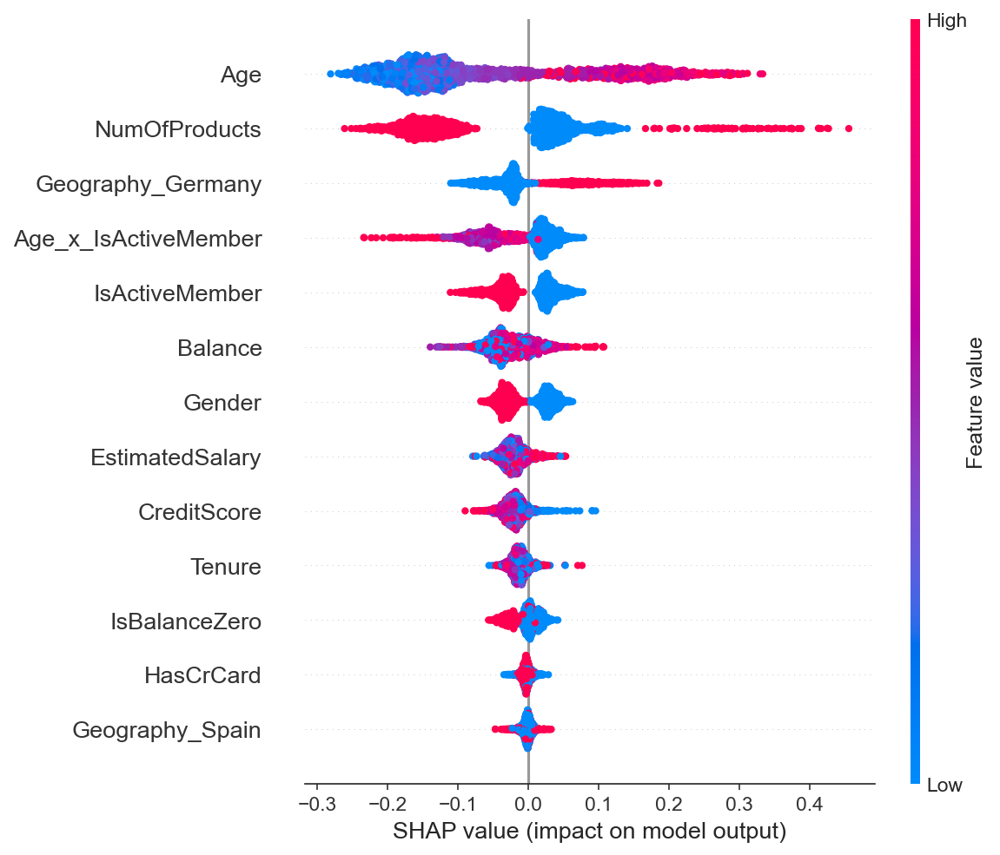
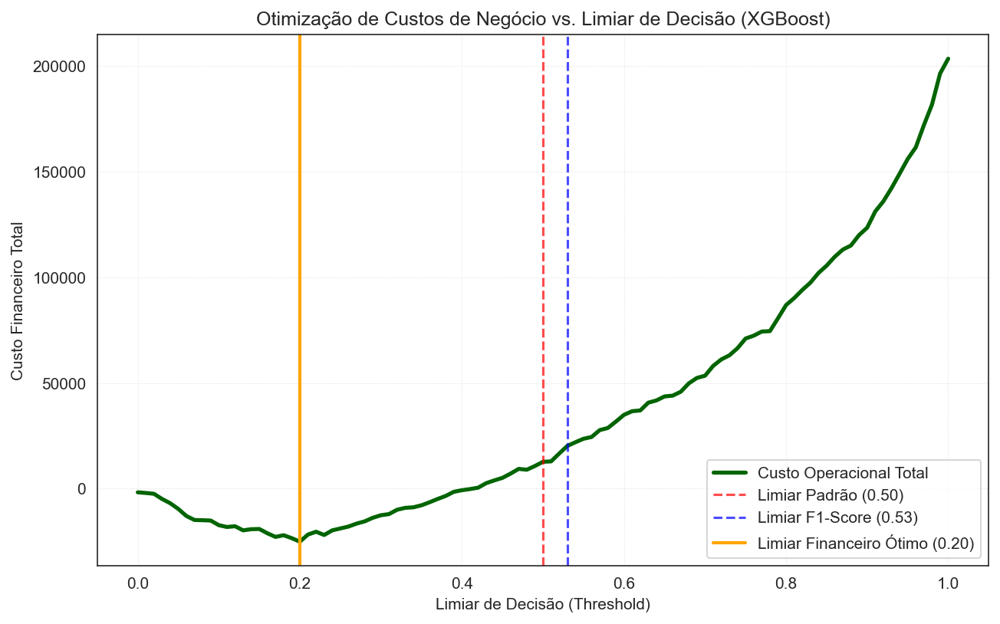

# 📊 Prevenção e Predição de Churn de Clientes Bancários

**Projeto EBAC & Semantix**
Fonte dos dados: https://www.kaggle.com/datasets/radheshyamkollipara/bank-customer-churn

---

## 📌 1. Visão Geral do Projeto & Problema de Negócio

No setor bancário e financeiro, a retenção de clientes é significativamente mais rentável do que a aquisição de novos clientes. O **Churn** (cancelamento/saída do cliente) representa uma perda direta de receita e valor de carteira.

Este projeto desenvolve uma solução completa de **Machine Learning de ponta a ponta** para prever a probabilidade de churn de clientes a partir de dados socioeconômicos e comportamentais (`data/Churn_Modelling.csv`).

### 🎯 Objetivos de Negócio:
1. **Identificar os principais fatores de risco** que levam o cliente ao encerramento da conta.
2. **Construir e comparar modelos preditivos avançados** (Dummy Classifier, Regressão Logística, Random Forest, XGBoost e SVM).
3. **Avaliar curvas de discriminação (ROC-AUC e PR-AUC)** para bases desbalanceadas.
4. **Otimizar o Limiar de Decisão (*Decision Threshold Tuning*)** para maximizar o **F1-Score** da classe de Churn.
5. **Exportar o modelo campeão** e fornecer um script de inferência standalone (`predict.py`) para consumo em produção.

---

## 💡 2. Principais Insights da Análise Exploratória (EDA)

* **Disparidade Geográfica (Alemanha):** A taxa de churn na **Alemanha é de ~32.4%**, praticamente o **dobro** em relação à França (~16.2%) e Espanha (~16.7%).
* **Efeito da Engajamento (Membros Ativos):** Clientes inativos apresentam quase **o dobro da taxa de churn** (26.9%) em comparação a membros ativos (14.2%).
* **Ponto Crítico de Produtos:** Clientes com **3 produtos atingem mais de 80% de churn**, e com **4 produtos a taxa é de 100%**. Isso indica uma forte insatisfação ou sobrecarga de ofertas/tarifas.
* **Score de Crédito Extremo:** Scores de crédito inferiores a 400 possuem taxa de churn de 100%.
* **Idade:** Clientes na faixa entre **35 e 60 anos** concentram a maior proporção de cancelamentos.

---

## 🛠️ 3. Metodologia de Machine Learning & MLOps

A esteira de modelagem seguiu os mais rigorosos padrões da indústria para evitar vazamento de dados (*Data Leakage*):

1. **Divisão Estratificada (Train/Test Split):** 80% treino e 20% teste com preservação da proporção da classe minoritária (`stratify=y`).
2. **Engenharia de Features:** 
   - `IsBalanceZero`: Indicador binário para saldo zerado.
   - `Age_x_IsActiveMember`: Interação entre idade e nível de atividade do membro.
3. **Pré-processamento com `ColumnTransformer` & `Pipeline`:** 
   - Padronização de variáveis numéricas (`StandardScaler`).
   - One-Hot Encoding para variáveis categóricas (`OneHotEncoder`).
4. **Baseline Naïve (`DummyClassifier`):** Comparação científica provando o valor gerado pelos modelos sobre um palpite ingênuo.
5. **Otimização via `GridSearchCV`:** Busca exaustiva de hiperparâmetros combinada com validação cruzada estratificada em 5 dobras (`StratifiedKFold`).
6. **Ajuste Fino de Limiar (*Decision Threshold Optimization*):** Busca de limiar ideal via predições *Out-of-Fold* (`cross_val_predict`) para maximização direta da métrica **F1-Score**.
7. **Avaliação por Curvas ROC-AUC e PR-AUC:** Análise gráfica da capacidade discriminatória dos modelos em bases desbalanceadas.
8. **Interpretabilidade com SHAP:** Uso de valores SHAP (*TreeExplainer*) para explicar a contribuição global e individual de cada feature no modelo.

   

9. **Inferência Standalone (`predict.py`):** Script Python pronto para produção simulando o consumo do modelo por microsserviços ou APIs.

---

## 📈 4. Comparativo de Desempenho dos Modelos (Dados de Teste)

| Modelo | Acurácia | Precisão (Churn) | Recall (Churn) | **F1-Score (Churn)** | Limiar Otimizado |
| :--- | :---: | :---: | :---: | :---: | :---: |
| **Dummy Classifier (Baseline Naïve)** | 79.60% | 0.00% | 0.00% | 0.00% | 0.50 |
| **Regressão Logística (Baseline)** | 71.90% | 39.28% | **69.78%** | 50.27% | 0.50 |
| **Random Forest (Otimizado)** | 84.50% | 62.09% | 61.18% | 61.63% | 0.55 |
| **SVM (Otimizado)** | **84.85%** | **62.68%** | 63.14% | 62.91% | 0.38 |
| **🏆 XGBoost (Otimizado - Campeão)** | 83.55% | 58.23% | 67.81% | **62.66%** | **0.53** |

### 🥇 Justificativa do Modelo Campeão:
Embora o *Dummy Classifier* apresente 79.60% de acurácia (por prever apenas a classe majoritária), ele possui **F1-Score de 0.00%**, provando que acurácia isolada é insuficiente em bases desbalanceadas. 
O **XGBoost Otimizado** apresentou a melhor combinação entre precisão (58.23%) e recall (67.81%), atingindo o maior **F1-Score absoluto (62.66%)**.

---

## 💼 5. Otimização de Custos de Negócio (Matriz de Custos)

Em aplicações de negócios reais, as métricas de avaliação estatística (como F1-Score) tratam os erros de classificação de forma simétrica. No entanto, para um banco varejista, os custos financeiros de um Falso Positivo (alarme falso) e de um Falso Negativo (perda não detectada de um cliente) são altamente assimétricos.

Para alinhar o modelo preditivo às necessidades do negócio, adotamos as seguintes **premissas estimadas (baseadas em médias do mercado de varejo bancário)**:
* **Falso Positivo (FP) - Custo de 50:** Custo operacional de realizar uma ação preventiva (ligações, isenção temporária de tarifas, descontos ou cashback) para um cliente que não iria cancelar a conta.
* **Falso Negativo (FN) - Custo de 500:** Perda definitiva da receita do cliente (LTV - Lifetime Value estimado do cliente no banco) por falhar em identificá-lo em risco de churn.
* **Verdadeiro Positivo (TP) - Retorno Líquido de -200:** Custo de retenção de 50 com uma taxa de conversão média de 50% de sucesso em salvar o LTV de 500. Retorno líquido = 50 - (0.50 * 500) = -200 (uma economia líquida esperada de 200 por cliente corretamente identificado).
* **Verdadeiro Negativo (TN) - Custo de 0:** Cliente satisfeito e retido sem gastos adicionais.

### Otimização do Limiar Financeiro vs. Estatístico (XGBoost)

Ao calcular o custo financeiro total sob diferentes limiares, obtemos os seguintes resultados na base de teste (2.000 clientes):

| Cenário de Decisão | Limiar (Threshold) | Custo Financeiro Total Esperado | Impacto / Economia Real |
| :--- | :---: | :---: | :---: |
| **Sem Modelo de Retenção** | 1.00 | 203.500,00 | Referência (Perda total dos FNs) |
| **Limiar Otimizado por F1-Score** | 0.53 | 20.200,00 | Economia de 183.300,00 |
| **Limiar Padrão** | 0.50 | 12.700,00 | Economia de 190.800,00 |
| **🏆 Limiar Financeiro Ótimo** | **0.20** | **-25.100,00** (Ganho Líquido) | **Economia de 228.600,00** |

Ao reduzir o limiar de decisão para **0.20**, o banco maximiza suas economias, transformando a perda operacional em um **ganho líquido de 25.100,00** no lote de testes. Isso ocorre porque evitar a perda de um cliente (FN = 500) é 10 vezes mais valioso do que evitar um alarme falso (FP = 50).

> [!TIP]
> **Decisão Baseada em Valor**: O limiar financeiro ótimo de **0.20** gerou uma economia adicional de **45.300,00** em comparação ao limiar otimizado puramente por F1-Score (0.53).



---

## 📊 6. Monitoramento em Produção (MLOps com Evidently AI)

Para garantir que o modelo continue performando bem em produção, implementamos uma rotina de monitoramento de **Data Drift (Desvio de Variáveis)** utilizando o **Evidently AI**. Esta etapa é crucial em MLOps, pois detecta se os dados de entrada na produção mudaram em relação aos dados de treinamento (o que pode deteriorar as previsões do modelo).

O script [monitor.py](file:///G:/projs/Semantix/monitor.py) realiza as seguintes etapas:
1. **Dados de Referência**: Utiliza os dados históricos de treino como baseline.
2. **Dados de Produção (Simulados)**: Carrega um lote atual de produção e aplica um desvio (*data drift*) intencional para testes (aumentando a idade média em ~5 anos e reduzindo o score de crédito em ~40 pontos).
3. **Análise Estatística**: Calcula o drift estatístico para cada uma das 10 variáveis preditoras.
4. **Relatório Interativo**: Gera um dashboard em HTML interativo contendo gráficos de distribuição e testes de hipóteses estatísticas.

### Como Gerar e Abrir o Relatório:
1. Execute o script de monitoramento no terminal:
   ```bash
   python monitor.py
   ```
2. Abra o relatório gerado em seu navegador:
   O arquivo interativo será salvo em [reports/relatorio_estabilidade.html](file:///G:/projs/Semantix/reports/relatorio_estabilidade.html).

---

## ⚙️ 7. Integração Contínua (CI com GitHub Actions)

Para garantir a qualidade do código e evitar que novos commits quebrem a inferência em produção, configuramos uma esteira de **Integração Contínua (CI)** com **GitHub Actions**.

O workflow automatizado realiza os seguintes passos a cada `push` ou `pull_request` na branch `main` ou `master`:
1. **Ambiente virtual**: Inicializa um contêiner Ubuntu e configura o Python 3.11.
2. **Dependências**: Instala todas as dependências contidas no `requirements.txt`.
3. **Execução de Testes**: Roda os testes unitários do arquivo [test_predict.py](file:///G:/projs/Semantix/test_predict.py).

Os testes unitários validam:
* Se o carregamento do modelo campeão (`modelo_churn_xgboost.pkl`) está íntegro e possui todas as chaves esperadas.
* Se a função de inferência (`prever_churn_cliente`) gera predições no formato correto, com probabilidades válidas (entre 0 e 100) e colunas corretas.

Você pode rodar os testes unitários localmente usando o comando:
```bash
python -m unittest test_predict.py
```

---

## 📁 8. Estrutura do Repositório

```text
├── .github/
│   └── workflows/
│       └── python-tests.yml         # Configuração da Action do GitHub (CI)
├── .gitignore                       # Arquivos ignorados pelo Git (venv, logs, etc.)
├── data/
│   └── Churn_Modelling.csv          # Base de dados original
├── images/
│   ├── shap_summary_plot.png        # Gráfico de interpretabilidade SHAP
│   └── otimizacao_custo_financeiro.png # Gráfico de custo operacional vs limiar
├── reports/
│   └── relatorio_estabilidade.html  # Dashboard de monitoramento de data drift
├── threshold_classifier.py          # Wrapper customizado para otimização de limiar
├── projeto semantix churn.ipynb     # Notebook Jupyter com a esteira completa
├── modelo_churn_xgboost.pkl         # Artefato do modelo campeão exportado (joblib)
├── predict.py                       # Script de inferência standalone para produção
├── test_predict.py                  # Script de testes unitários para a inferência
├── monitor.py                       # Rotina de monitoramento de drift em produção
├── requirements.txt                 # Dependências do projeto
└── README.md                        # Documentação executiva do projeto
```

---

## 🚀 9. Como Executar o Projeto

1. **Clonar o Repositório:**
   ```bash
   git clone https://github.com/marcs0409/Semantix
   cd Semantix
   ```

2. **Instalar as Dependências:**
   ```bash
   pip install -r requirements.txt
   ```

3. **Executar o Notebook:**
   Abra o Jupyter Notebook ou PyCharm e execute as células sequencialmente em `projeto semantix churn.ipynb`.

4. **Executar Teste de Inferência via Linha de Comando:**
   ```bash
   python predict.py
   ```

5. **Executar Rotina de Monitoramento de Data Drift:**
   ```bash
   python monitor.py
   ```

6. **Executar a Suíte de Testes Unitários:**
   ```bash
   python -m unittest test_predict.py
   ```

---
*Projeto desenvolvido em Data Science na EBAC em parceria com a Semantix.*
